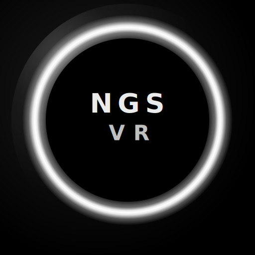

  

<h1 align="center">NGSVR - Next Generation Social VR</h1>

  An open source, community-driven social VR platform built in Unreal Engine 5. 
  PC-first. SteamVR-native. No walled gardens.

  
  
  
  

---

# NGSVR - Next Generation Social VR

> An open source, community-driven social VR platform built in Unreal Engine 5.  
> PC-first. SteamVR-native. No walled gardens.

---

## What is NGSVR?

NGSVR is an open source alternative to platforms like VRChat, built from the ground up in **Unreal Engine 5**. The goal is a fully open, self-hostable social VR experience - user generated avatars, user generated worlds, full body tracking, face tracking, and rich social interaction - without the closed ecosystem, without the corporate gatekeeping, and without the compromises.

This project is in early development. Right now we are building the **proof of concept** - getting the core pillars working before expanding scope. If you believe in open social VR, this is the place to build it.

---

## Core Goals

- 🌐 **Open Source** - Fully GPLv3. Fork it, self-host it, contribute to it.
- 🖥️ **PC First** - Desktop mode and VR mode (SteamVR / OpenXR). No standalone device compromises.
- 🧍 **User Avatars** - Runtime VRM avatar loading. Bring your existing avatars.
- 🌍 **User Worlds** - Community-created spaces you can visit and host.
- 🗣️ **Rich Social Features** - Spatial voice, text chat, hosted instances, friend system.
- 🦾 **Full Body Tracking** - Native SteamVR tracker support (SlimeVR, Vive, etc).
- 😮 **Face & Eye Tracking** - OpenXR face tracking extensions (Quest Pro, VIVE Focus, Pico 4 Pro).
- 🔓 **Self-Hostable** - Run your own instance. Own your community.

---

## Current Status

> ⚠️ This project is in early proof-of-concept stage. Nothing is stable. Everything is being built.

| Milestone | Status |
|---|---|
| M1 - Multiplayer presence (two players, one room) | 🔨 In Progress |
| M2 - Runtime VRM avatar loading + IK | 📋 Planned |
| M3 - Instance system, voice chat, FBT | 📋 Planned |
| M4 - Face & eye tracking | 📋 Planned |
| M5 - User world loading | 📋 Planned |

---

## Tech Stack

| Area | Technology |
|---|---|
| Engine | Unreal Engine 5 (latest stable) |
| VR Runtime | OpenXR (SteamVR, Air Link, Virtual Desktop) |
| Networking | Epic Online Services (EOS) |
| Voice | Vivox |
| Avatar Format | VRM (open standard) |
| World Format | glTF / GLB |
| Platform | Windows PC (Desktop + VR) |

---

## Why Not Just Use VRChat / ChilloutVR / Resonite?

Those are great platforms, but they are all **closed**. You cannot self-host them. You cannot audit their code. You cannot fix what bothers you. You are always at the mercy of a company's decisions.

NGSVR is different. If you don't like something, open a PR and change it.

---

## Getting Started (Contributors)

> Full setup guide coming soon. The project is not yet in a buildable state for contributors, but that is the first milestone.

**Prerequisites (when ready):**
- Unreal Engine 5.4+
- Visual Studio 2022
- Windows 10/11
- Git + Git LFS

Watch this repo and join the Discord (coming soon) to be notified when the first contributor build is ready.

---

## Contributing

We welcome contributors of all kinds:

- 💻 **Unreal / C++ developers** - core systems, networking, VR integration
- 🎨 **Technical artists** - avatar pipeline, shaders, world tooling
- 🧪 **Testers** - VR hardware coverage (different headsets, tracker setups)
- 📝 **Docs writers** - architecture docs, setup guides, wikis
- 🎭 **Avatar / world creators** - test content for early builds

Please read [CONTRIBUTING.md](Docs/CONTRIBUTING.md) before opening a PR.

---

## Roadmap

See [ROADMAP.md](Docs/ROADMAP.md) for the full breakdown of planned milestones and features.

---

## License

NGSVR is licensed under the **GNU General Public License v3.0**.  
See [LICENSE](LICENSE) for full details.

---

## Community

- 💬 Discord - *coming soon*
- 🐛 Issues - [GitHub Issues](../../issues)
- 💡 Feature Requests - [GitHub Issues](../../issues) (use the feature request template)

---

*Built by the community, for the community. No VC funding. No corporate agenda. Just open social VR.*
